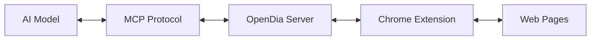

# OpenDia ✳️

> **The open alternative to Dia**  
> Connect your browser to AI models through MCP. No browser switching needed—works seamlessly with Chrome and Arc.

[](https://badge.fury.io/js/opendia)
[](https://opensource.org/licenses/MIT)

## 🚀 What is OpenDia?

OpenDia bridges your browser and AI models through the Model Context Protocol (MCP). It exposes 17 powerful browser automation tools that let AI models interact with web pages, manage tabs, extract content, and automate workflows—all with anti-detection capabilities for major platforms.

**✨ Key Benefits:**
- 🔄 **Universal AI Support**: Works with Sonnet, o3 and even local models
- 🎯 **Anti-Detection**: Specialized bypasses for Twitter/X, LinkedIn, Facebook
- 📱 **Smart Automation**: Two-phase intelligent page analysis
- 🛡️ **Privacy-First**: Runs locally, your data stays with you
- ⚡ **Zero Setup**: Get started with `npx opendia`

## 🎬 Demo Workflows

**Real workflows you can run today:**

### 📰 Content & Social Media
- **Daily Reading Summary**: Summarize articles you've read today & auto-post to Twitter
- **Smart Recommendations**: Get personalized content suggestions based on your browsing history
- **Bookmark Analysis**: Browse & summarize all your X/Twitter bookmarks
- **Article Research**: Ask questions about any webpage and get instant answers

### 📧 Productivity 
- **Email Intelligence**: Browse and analyze your latest emails
- **Tab Management**: Organize and switch between research sessions
- **History Mining**: Find that article you read last week with natural language queries
- **Content Extraction**: Turn any webpage into structured data

### 🤖 Advanced Automation
- **Multi-tab Workflows**: Coordinate actions across multiple browser tabs
- **Form Filling**: Auto-fill forms with anti-detection on social platforms
- **Content Publishing**: Draft and publish social media posts with AI assistance
- **Research Automation**: Gather information from multiple sources automatically

## ⚡ Quick Start

### Option 1: Instant Setup (Recommended)
```bash
# Start the MCP server (no installation required)
npx opendia
```

### Option 2: Global Installation
```bash
npm install -g opendia
opendia
```

### Setup the Chrome Extension
1. Download from [releases](https://github.com/aaronjmars/opendia/releases)
2. Go to `chrome://extensions/`
3. Enable "Developer mode"
4. Click "Load unpacked" and select the extension folder

### Connect to your AI client
Add to your MCP configuration:
```json
{
  "mcpServers": {
    "opendia": {
      "command": "npx",
      "args": ["opendia"]
    }
  }
}
```

## 🛠️ Available Tools (17 Total)

### 🌐 Page Analysis & Interaction
| Tool | Description | Use Case |
|------|-------------|----------|
| `page_analyze` | Two-phase intelligent page analysis | Find elements to interact with |
| `page_extract_content` | Smart content extraction with summarization | Get article text, search results, social posts |
| `element_click` | Click elements with smart targeting | Press buttons, follow links |
| `element_fill` | Fill forms with anti-detection bypass | Post tweets, fill login forms |
| `element_get_state` | Check element properties and states | Verify if buttons are clickable |
| `page_navigate` | Navigate to URLs with wait conditions | Go to specific pages |
| `page_wait_for` | Wait for elements or conditions | Ensure page loads before actions |
| `page_scroll` | Scroll pages in any direction | Navigate long pages, infinite scroll |

### 📑 Tab Management
| Tool | Description | Use Case |
|------|-------------|----------|
| `tab_create` | Create new tabs with options | Open multiple research tabs |
| `tab_close` | Close specific or current tabs | Clean up workspace |
| `tab_list` | Get all open tabs with details | See what's currently open |
| `tab_switch` | Switch between tabs by ID | Navigate between research |

### 📊 Browser Data Access
| Tool | Description | Use Case |
|------|-------------|----------|
| `get_bookmarks` | Access and search bookmarks | Find saved resources |
| `add_bookmark` | Create new bookmarks | Save important pages |
| `get_history` | Search browser history with filters | Find previously visited content |
| `get_selected_text` | Get currently selected text | Work with highlighted content |
| `get_page_links` | Extract all links from current page | Analyze page structure, find resources |

## 🎯 Anti-Detection Features

OpenDia includes specialized bypasses for platforms that typically block automation:

- **🐦 Twitter/X**: Direct DOM manipulation bypassing React detection
- **💼 LinkedIn**: Enhanced focus sequences for professional posting
- **📘 Facebook**: Event simulation for social interactions
- **🌐 Universal**: Fallback methods for any website

## 🏗️ Architecture



## 🔧 Configuration

### Environment Variables
```bash
PORT=3000          # WebSocket server port
HEALTH_PORT=3001   # Health check HTTP port
NODE_ENV=development
```

### CLI Options
```bash
npx opendia --help                 # Show help
npx opendia --port 3005           # Custom WebSocket port
npx opendia --health-port 3002    # Custom health check port
npx opendia --version             # Show version
```

## 🚦 System Requirements

- **Node.js**: Version 14 or higher
- **Browser**: Chrome or Arc (Chromium-based)
- **AI Client**: Any MCP-compatible client (Claude Desktop, custom implementations)

## 📖 Examples

### Extract and Summarize Current Page
```python
# Using the MCP tools
result = await call_tool("page_extract_content", {
    "content_type": "article",
    "summarize": True
})
print(f"Summary: {result['summary']['preview']}")
```

### Auto-post to Twitter
```python
# Analyze page for tweet composition
elements = await call_tool("page_analyze", {
    "intent_hint": "post_tweet",
    "phase": "discover"
})

# Fill the tweet
await call_tool("element_fill", {
    "element_id": elements['elements'][0]['id'],
    "value": "Just discovered something amazing! 🚀"
})

# Click tweet button
await call_tool("element_click", {
    "element_id": elements['elements'][1]['id']
})
```

### Research Multiple Articles
```python
# Get browser history for today
history = await call_tool("get_history", {
    "keywords": "AI research",
    "start_date": "2024-01-01T00:00:00Z",
    "max_results": 10
})

# Visit each article and extract content
for item in history['history_items']:
    await call_tool("page_navigate", {"url": item['url']})
    content = await call_tool("page_extract_content", {
        "content_type": "article",
        "summarize": True
    })
    print(f"Article: {content['summary']['title']}")
```

## 🔒 Security & Privacy

**Important Security Notice**: This extension requires broad browser permissions and establishes localhost connections. Use responsibly:

- ✅ **Local-first**: All data processing happens on your machine
- ✅ **No tracking**: We don't collect or transmit your browsing data
- ✅ **Open source**: Full transparency of what the code does
- ⚠️ **Developer tool**: Intended for technical users who understand the risks
- ⚠️ **Localhost only**: WebSocket server binds to localhost by default

## 🤝 Contributing

We welcome contributions! Here's how you can help:

### Adding New Tools
1. Add tool definition in `background.js` → `getAvailableTools()`
2. Implement handler in `handleMCPRequest()`
3. Test with the extension
4. Submit a PR

### Development Setup
```bash
git clone https://github.com/yourusername/opendia.git
cd opendia

# Start MCP server
cd opendia-mcp
npm install
npm start

# Load extension in Chrome
# Go to chrome://extensions/
# Enable Developer mode
# Load unpacked: ./opendia-extension
```

### Roadmap
- [ ] Firefox extension support
- [ ] Additional social platform bypasses  
- [ ] Visual element selector
- [ ] Workflow recorder/playback
- [ ] Enterprise authentication support

## 📝 License

MIT License - see [LICENSE](LICENSE) for details.

## 🆘 Support

- 📖 **Documentation**: [GitHub Wiki](https://github.com/aaronjmars/opendia/wiki)
- 🐛 **Issues**: [GitHub Issues](https://github.com/aaronjmars/opendia/issues)
- 💬 **Discussions**: [GitHub Discussions](https://github.com/aaronjmars/opendia/discussions)

## 🙏 Acknowledgments

Built with:
- [Model Context Protocol](https://modelcontextprotocol.io/) by Anthropic
- Chrome Extensions API
- WebSocket for real-time communication

---

**Made with ✨ by developers who believe AI should seamlessly integrate with your workflow.**